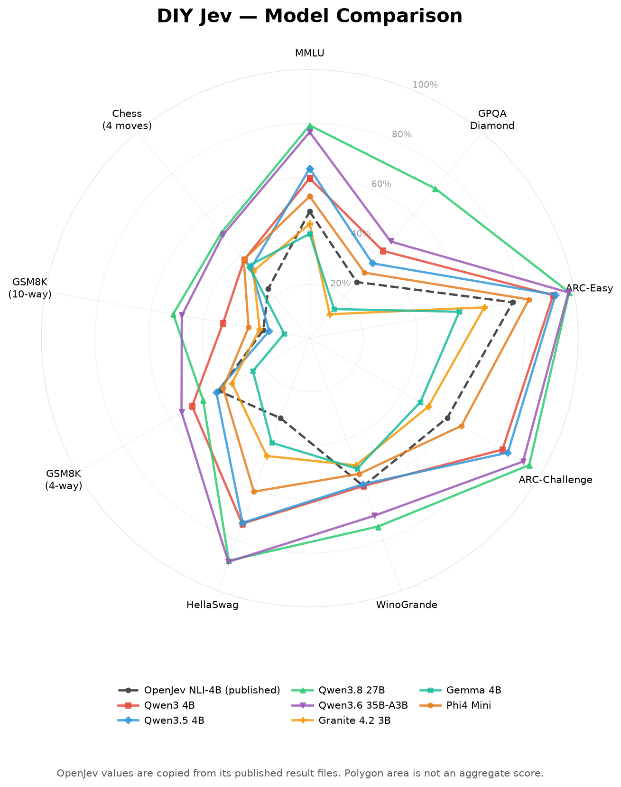

# DIY Jev

A Jev-compatible decision server built on llama.cpp. It keeps one GGUF model
loaded, accepts Jev `noul`, `choice`, and `score` questions, and returns typed
answers with a distribution over the legal decisions.

This is an inference technique, not a trained Jev model. **Nothing is trained,
fine-tuned, or modified.** Unlike OpenJev's fine-tuned/NLI approach, DIY Jev
uses the next-token logits already present in a compatible instruction model.

It implements the public Jev API shape; it does not reproduce TypeSafe's
proprietary model, training, or calibration.

## How it works

DIY Jev does not use a chat template and does not generate JSON. It tokenizes a
small raw tagged prompt:

```text
<state>...</state>
<question>...</question>
<options>
returns:Returns and exchanges
shipping:Delivery issues
</options>
<candidate>returns</candidate>
<verdict>
```

For every Choice or Score candidate, the model answers one internal question:
is this candidate correct? We read the next-token logits for `true` and
`false` at `<verdict>`, then compute:

```text
candidate score = logit(true) - logit(false)
```

The candidate scores are normalized together with a softmax. The highest score
becomes the Choice answer; Score returns the probability-weighted rubric index.
Noul uses the same true/false log-odds directly through a sigmoid.

There is no sampler, autoregressive generation, response parsing, or arbitrary
output space. Candidate branches share their common prompt prefix in the KV
cache, while each API question remains an independent decision against the same
state. The model stays resident in a single inference worker between requests.

The returned probabilities are relative model scores, not automatically
calibrated probabilities of correctness.

## Run

The default build uses CUDA and requires a working CUDA installation plus the
normal Rust/C++ build toolchain.

```sh
cargo run --release
```

With no model configuration, startup lists the GGUF files in `./models`:

```text
Local GGUF models:
  1) ./models/Qwen3.5-4B-Q4_K_M.gguf (2.74 GiB)
  2) ./models/qwen3-4b-instruct-Q4_K_M.gguf (2.32 GiB)
  d) Download a Hugging Face GGUF
Select a model:
```

Choose a number, or enter `d` and paste the Hugging Face repository and exact,
case-sensitive GGUF filename. The file is downloaded into `./models` and loaded.

For unattended startup, configure either an existing `JEV_MODEL_PATH`, or both
`JEV_HF_REPO` and `JEV_HF_FILENAME`. The server listens on
`http://127.0.0.1:8080`.

## Benchmark



*Accuracy on the reconstructed nine-axis suite. OpenJev values come from its
published result files; polygon area is not an aggregate score.*

Start the server, then run the included OpenJev radar reconstruction:

```sh
python3 benchmarks/benchmark.py server
```

On first use it installs its isolated Python dependencies, downloads the source
datasets, and creates the fixture under `benchmarks/data`. It sends ten concurrent
requests by default, shows progress, and writes `results.json` plus `radar.png`
under `benchmarks/results_<model-name>/`.

Generate comparison, calibration, and latency charts for all saved runs with:

```sh
python3 benchmarks/analyze.py
```

DIY Jev also works directly with
[JevBench](https://github.com/fstandhartinger/jevbench): use its existing
`typesafe` adapter with endpoint `http://127.0.0.1:8080`. JevBench runs requests
serially, so leave cross-request batching disabled for comparable latency.
Public-subset results are not an official JevBench score because the official
evaluation also contains held-out decisions.

Historical benchmark notes and provenance caveats are in
[benchmarks/RESULTS.md](benchmarks/RESULTS.md).

## API

The TypeSafe-compatible endpoint is `POST /v1/systemone`. `/`, `/v1/evaluate`,
and `/ai/run` accept the same body.

```sh
curl http://127.0.0.1:8080/v1/systemone \
  -H 'content-type: application/json' \
  -d '{
    "state": "I ordered size 10 shoes but received size 8.",
    "questions": {
      "department": {
        "type": "choice",
        "instructions": "Which department handles this?",
        "criteria": {
          "returns": "Returns and exchanges",
          "shipping": "Delivery issues",
          "billing": "Charges and refunds"
        }
      },
      "refund": {
        "type": "noul",
        "instructions": "Is the customer asking for a refund?"
      }
    }
  }'
```

The full contract is in [openapi.yaml](openapi.yaml). `GET /health` reports the
HTTP process and `GET /ready` reports whether the model worker is available.


## Notes

- A compatible tokenizer must expose `true` and `false` as single-token
  continuations at the verdict boundary. Startup checks this.
- GGUF is a container format, not a compatibility guarantee; llama.cpp must
  support the model architecture.
- Cross-request batching is experimental and disabled by default because batch
  shape can change quantized-model scores. Candidate batching within one
  question remains enabled.
- The server has no authentication or TLS. See [SECURITY.md](SECURITY.md) before
  exposing it outside a trusted network.

MIT licensed. See [ATTRIBUTION.md](ATTRIBUTION.md) for upstream projects,
models, and benchmark sources.
