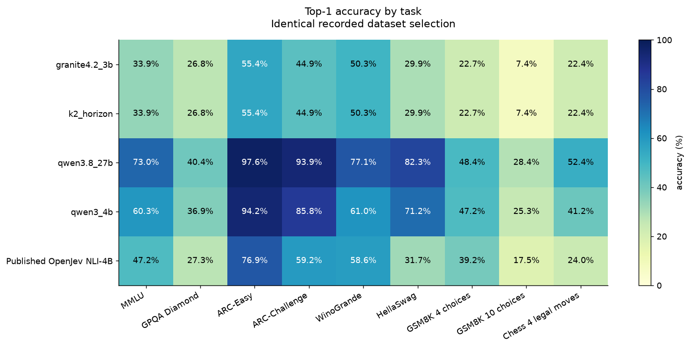
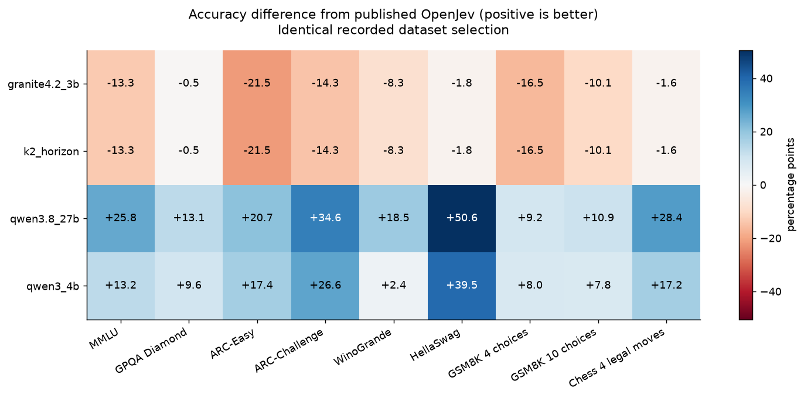
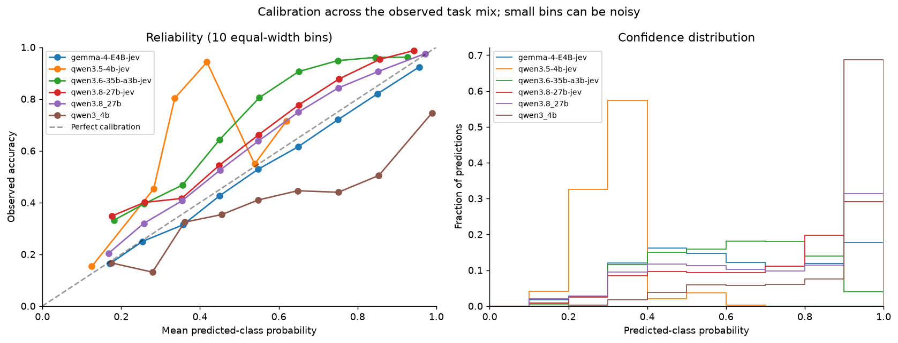
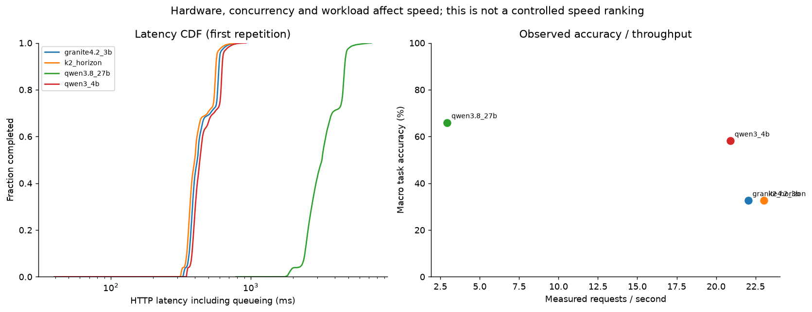

# Benchmark analysis

Identical recorded dataset selection.

Macro accuracy weights each available task equally; micro accuracy weights every question equally.
Published OpenJev scores are full-suite reference values, not paired predictions.
GSM8K distractor ordering, dataset revisions and subset selection can affect comparability.

| Model | Questions | Tasks | Micro accuracy | Macro accuracy | NLL | ECE | Requests/s | Concurrency |
|---|---:|---:|---:|---:|---:|---:|---:|---:|
| granite4.2_3b | 32235 | 9 | 33.51% | 32.63% | 1.381 | 0.048 | 22.03 | 10 |
| k2_horizon | 32235 | 9 | 33.51% | 32.63% | 1.381 | 0.048 | 23.05 | 10 |
| qwen3.8_27b | 32235 | 9 | 75.27% | 65.94% | 0.687 | 0.053 | 2.93 | 10 |
| qwen3_4b | 32235 | 9 | 64.76% | 58.13% | 2.273 | 0.237 | 20.90 | 10 |

## Charts

## Data checks

- k2_horizon and granite4.2_3b have identical predictions and probability vectors for every example. Verify the served model identity before treating these as independent model measurements.

## Sources

- ./benchmarks/results_granite4.2_3b/granite.json
- ./benchmarks/results_k2_horizon/granite.json
- ./benchmarks/results_qwen3.8_27b/granite.json
- ./benchmarks/results_qwen3_4b/granite.json
- https://huggingface.co/AlexWortega/openjev/blob/main/results/qwen4b_all.json
- https://huggingface.co/AlexWortega/openjev/blob/main/results/qwen4b_extra_mc.json
